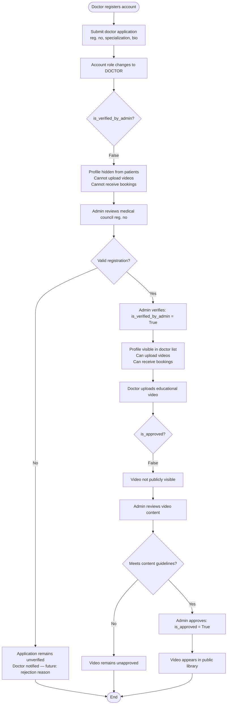

# Activity Diagram — Doctor Onboarding & Video Approval

```mermaid
flowchart TD
    Start([Doctor registers account]) --> Apply[Submit doctor application\nreg. no, specialization, bio]
    Apply --> RoleFlip[Account role changes to DOCTOR]
    RoleFlip --> Pending{is_verified_by_admin?}
    Pending -->|False| Hidden[Profile hidden from patients\nCannot upload videos\nCannot receive bookings]
    Hidden --> AdminReview[Admin reviews medical council reg. no]
    AdminReview --> Decision{Valid registration?}
    Decision -->|Yes| Verify[Admin verifies: is_verified_by_admin = True]
    Decision -->|No| Rejected[Application remains unverified\nDoctor notified — future: rejection reason]
    Verify --> Visible[Profile visible in doctor list\nCan upload videos\nCan receive bookings]

    Visible --> UploadVideo[Doctor uploads educational video]
    UploadVideo --> VideoPending{is_approved?}
    VideoPending -->|False| VideoHidden[Video not publicly visible]
    VideoHidden --> AdminModeration[Admin reviews video content]
    AdminModeration --> VideoDecision{Meets content guidelines?}
    VideoDecision -->|Yes| VideoApprove[Admin approves: is_approved = True]
    VideoDecision -->|No| VideoReject[Video remains unapproved]
    VideoApprove --> VideoLive[Video appears in public library]

    Rejected --> End([End])
    VideoReject --> End
    VideoLive --> End
```
